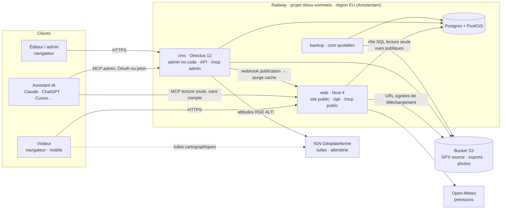
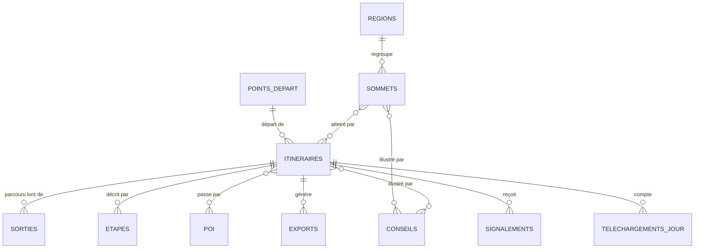
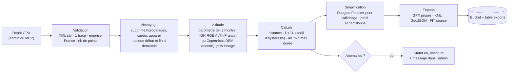

# Architecture technique — Obiou Sommets

> Statut : **proposition** (13 septembre 2026). Rien n'est encore construit ni déployé.
> **Décidé le 13 sept. 2026** : sous-domaine `sommets.obiou.eu` ; site personnel **non commercial,
> sans publicité** ; contenu = **les sorties faites par l'auteur, dans les Alpes et en Corée du Sud**.

## 1. Hypothèses de départ

- **Public** : visiteurs sans compte. Ils consultent la carte, les fiches et téléchargent les traces.
  Pas de compte obligatoire au lancement (les favoris restent dans le navigateur).
- **Admin** : l'auteur, éventuellement 1 ou 2 proches, qui créent et maintiennent sommets,
  itinéraires, sorties, conseils et médias.
- **MCP** : un accès **public en lecture seule** (sans compte) et un accès **admin authentifié**
  (lecture + écriture de brouillons).
- **Périmètre** : un **carnet de sommets personnel**. Sommets gravis par l'auteur dans les Alpes
  (France, et Suisse ou Italie le cas échéant) et en Corée du Sud. Les traces et les photos sont
  les siennes. Conséquence technique majeure : **les fonds IGN ne couvrent que la France**, il faut
  un fond mondial (§ 7) et une source d'altitude mondiale (§ 6).
- **Volume** : quelques centaines de sommets et un millier d'itinéraires à terme. Trafic modeste
  avec un pic en saison (mai–octobre).
- **Équipe** : une personne + Claude Code. On choisit des technologies connues et « ennuyeuses »,
  proches de ce qui tourne déjà sur obiou.eu (Nuxt, Postgres, Railway, Resend).

## 2. Vue d'ensemble



**Le principe structurant : l'écriture passe par Directus, la lecture publique n'en dépend pas.**

- Directus possède le modèle d'écriture : formulaires admin, rôles, workflow de publication,
  fichiers, MCP admin.
- Le site public et le MCP public lisent Postgres **directement**, via des **vues SQL publiques**
  (`public_sommets`, `public_itineraires`…) qui ne montrent que le contenu publié, avec un rôle
  Postgres en lecture seule.

Ce découpage apporte trois choses :

1. **Résilience** : si Directus tombe ou redémarre, le site public continue de servir.
2. **Pleine puissance PostGIS** : recherche « à moins de 30 km de Grenoble », sommets dans l'emprise
   de la carte, tri par distance. L'API générique d'un CMS ne sait pas bien faire ça.
3. **Porte de sortie** : si la licence ou la trajectoire de Directus change, on remplace l'admin sans
   toucher au site public. Les vues SQL sont le contrat.

## 3. Choix de stack

| Brique | Choix | Pourquoi | Écarté |
|---|---|---|---|
| Site public | **Nuxt 4** (Vue 3, SSR) | Déjà maîtrisé sur obioucounting. SSR indispensable pour le SEO des fiches. Nuxt 5 est attendu fin 2026 : on démarre en 4.x et on migrera. | Next.js (stack React à apprendre), SPA pure (SEO faible) |
| Admin no-code | **Directus 12** | Admin généré depuis le schéma, **champs géographiques natifs (PostGIS) avec interface carte**, stockage S3, rôles et permissions fins, révisions, Flows (automatisations sans code), **serveur MCP intégré** (OAuth ou jeton statique, hérite des permissions). Extensions en Vue, donc dans tes compétences. | **Payload 3** : excellent (MIT, schéma en code, plugin MCP officiel), mais Next/React et MCP par clé API uniquement. Admin maison : des mois de travail pour refaire un CMS. |
| Base de données | **PostgreSQL + PostGIS** | Géométries (points, traces), index spatiaux, recherche plein texte avec `unaccent`. | Base NoSQL ou fichiers GeoJSON (pas de requêtes spatiales) |
| Carte | **MapLibre GL JS** | Libre (BSD), tuiles vectorielles, clustering natif, terrain 3D possible. | Leaflet (raster uniquement, moins fluide), Mapbox (licence et coûts) |
| Fonds de carte | **IGN Géoplateforme** en France, **fond « outdoor » OpenStreetMap** ailleurs | Plan IGN et photos aériennes **sans clé**. SCAN 25 : **licence grand public à signer** avec l'IGN, même pour un site non commercial (§ 7, D4). Hors de France (Suisse, Italie, Corée), un style outdoor basé sur OSM, avec courbes de niveau et relief. | Google/Mapbox (coût), IGN seul (s'arrête à la frontière) |
| MCP public | **@nuxtjs/mcp-toolkit** dans l'app Nuxt | Module Nuxt officiel basé sur le SDK MCP : outils déclarés par fichier, validation Zod. Pas de service en plus. | Service MCP séparé (un service de plus à opérer) |
| MCP admin | **MCP intégré de Directus** | Gratuit, gouverné par les permissions Directus, journal d'audit, suppression désactivée par défaut. | MCP admin maison (réécrire les permissions) |
| Traitement GPX | **Package TS pur `packages/geo`** | Testable sans framework, réutilisé par le hook Directus et par le MCP. | Traitement dans le navigateur (non fiable) |
| Fichiers | **Bucket S3** (Railway Bucket / Tigris) | Déjà utilisé sur obioucounting. Données publiques, donc peu sensibles. | Volume disque (pas de CDN, sauvegardes complexes) |
| E-mails | **Aucun** (décision du 14 sept. 2026) | Railway Hobby bloque le SMTP sortant et Directus n'a pas de transport Resend par API. Comptes créés à la main. | Mailgun par API (possible plus tard), Railway Pro |
| Hébergement | **Railway**, projet dédié | Déjà en place, déploiement depuis GitHub, TLS automatique. | VPS (voir la décision d'hébergement d'obioucounting : pas avant les seuils) |
| Météo | **Open-Meteo** | Gratuit, sans clé, modèles Météo-France inclus. ⚠️ Usage non commercial gratuit : à revoir si le site est monétisé. | API Météo-France (clé, quotas) |

### Licence Directus, à connaître

Depuis la v12 (mai 2026), Directus est sous licence **MSCL** (source disponible). Il est gratuit via
l'« Innovation Grant » pour les structures à **moins de 5 M$ de revenus et moins de 50 salariés**,
avec une clé d'enregistrement. Chaque version passe en GPLv3 après 4 ans. C'est acceptable ici. La
lecture publique via vues SQL (§ 2) limite le risque de dépendance.

## 4. Découpage en services

| Service Railway | Contenu | Domaine public |
|---|---|---|
| `web` | Nuxt 4 : pages publiques, `/api/*` (BFF), `/mcp` (MCP public), `/telecharger/*`, sitemap | `sommets.obiou.eu` |
| `cms` | Image Directus 12 + extensions maison + snapshot de schéma | `admin.sommets.obiou.eu` |
| `postgres` | Postgres + PostGIS, volume persistant | privé uniquement |
| `backup` | Cron `pg_dump` chiffré vers le bucket (même modèle qu'obioucounting) | aucun |
| bucket | `obiou-sommets-files` : GPX source, exports, photos | via URL signées ou `/assets` Directus |

**Isolation** : projet Railway **séparé** d'obioucounting. Aucune base, variable ou jeton partagé
avec l'application financière.

## 5. Modèle de données

> Vue d'ensemble. Le détail champ par champ, avec les décisions du 18 sept. 2026, est dans
> [05-modele-de-donnees.md](05-modele-de-donnees.md), qui fait foi une fois validé.



### Collections principales (Directus)

**`regions`** (hiérarchie pays › région › massif) : `nom` · `slug` · `pays` (code ISO) · `parent` ·
`fond_carte` (ign · osm) · `geometrie` (facultative)

**`sommets`**
`statut` (brouillon · en_relecture · publié · archivé) · `nom` · `nom_local` (ex. 한라산) ·
`romanisation` · `slug` · `altitude_m` · `position` (Point) · `region` → regions · `communes` ·
`description` (texte riche) · `photo_couverture` · `galerie` · `mois_conseilles` · `tags` ·
`credits_sources` · `date_publication`

**`sorties`** (le carnet) : `itineraire` · `date` · `duree_reelle_min` · `heure_depart` ·
`conditions` (météo, neige, affluence) · `recit` (texte court) · `photos` · `gpx_brut` (privé,
jamais publié tel quel). Une sortie alimente la « date de dernière vérification » de l'itinéraire.

**`itineraires`**
`statut` · `nom` · `slug` · `sommets` (M2M ordonné, pour les traversées) · `point_depart` ·
`type` (aller-retour · boucle · traversée) · `gpx_source` (fichier) · **calculés par le pipeline** :
`trace` (LineString 3D), `trace_simplifiee`, `profil` (JSON échantillonné), `distance_km`,
`denivele_pos_m`, `denivele_neg_m`, `altitude_min_m`, `altitude_max_m`, `duree_estimee_min`
(modifiable à la main) · `cotation` (SAC T1–T6, D2 au § 14) · `passages_delicats` ·
`mois_praticables` · `equipement` · `points_eau` · `dangers` · `acces_transport_commun` ·
`reservation_requise` + `reglementation` (quotas, fermetures saisonnières des parcs nationaux
coréens, zones de quiétude) ·
`derniere_verification` (date) · `verifie_par` · `anomalies_pipeline` (JSON)

**`points_depart`** : `nom` · `position` · `altitude_m` · `acces_routier` · `parking` (capacité,
payant) · `transport_commun` (texte + lien) · `commune`

**`poi`** : `type` (refuge · cabane · source · point de vue · passage clé · danger) · `nom` ·
`position` · `description` · `lien`

**`etapes`** : `itineraire` · `ordre` · `titre` · `texte` · `position` (optionnelle) · `photo`

**`conseils`** : `titre` · `texte` · `categorie` (sécurité · logistique · saison · faune-flore ·
photo) · rattachement global, sommet ou itinéraire

**`exports`** : `itineraire` · `format` (gpx · kml · geojson · fit) · `fichier` · `taille` ·
`sha256` · `genere_le`

**`signalements`** : `cible` · `type` (trace erronée · danger · info obsolète · autre) · `message` ·
`email` (facultatif) · `statut` · `cree_le`. Purge automatique au bout de 12 mois.

**`telechargements_jour`** : `itineraire` · `format` · `jour` · `compteur`. **Agrégé, sans IP ni
identifiant.**

**Singletons** : `parametres_site` (bandeau d'alerte, fond de carte par défaut), `pages`
(à propos, guides, mentions légales, éditables sans code).

### Gouvernance du schéma

« Sans coder » s'applique au **contenu**, pas au **schéma**. Toute modification de schéma se fait
dans Directus **staging**, puis est exportée (`directus schema snapshot`) dans
`apps/cms/snapshots/`, relue en PR, et appliquée en production au déploiement
(`directus schema apply`). En production, seul l'admin technique peut modifier le modèle de
données. Un test de contrat vérifie que les vues SQL publiques compilent contre le snapshot.

## 6. Pipeline GPX

Déclenché par un **hook Directus** (extension) quand un GPX est déposé ou remplacé sur un itinéraire.
La logique vit dans `packages/geo`, testée sur un corpus de vrais GPX.



Points d'attention :

- **Altitude** : l'altitude GPS brute est bruitée et gonfle le D+ de 10 à 30 %. Source choisie par
  itinéraire, avec détection automatique et possibilité de changer à la main :
  1. **baromètre** de la montre, si le GPX en contient (souvent le plus juste en terrain raide),
     simplement lissé ;
  2. en France, l'[API altimétrie de la Géoplateforme](https://cartes.gouv.fr/aide/fr/guides-utilisateur/utiliser-les-services-de-la-geoplateforme/calcul-altimetrique/)
     (RGE ALTI, gratuite, sans clé, **5 requêtes/s par IP** : on regroupe les points par lots et on
     met en cache) ;
  3. ailleurs (Suisse, Italie, Corée), un modèle numérique de terrain mondial **Copernicus DEM**
     (30 à 90 m de résolution, moins précis sur les crêtes). Fournisseur à valider en phase 2.
- **Zone de confidentialité** : option pour retirer les 200 premiers et derniers mètres quand une
  trace part d'un domicile ou d'un hébergement.
- **D+/D-** : cumul avec un seuil d'hystérésis (environ 5 m) pour ignorer les micro-variations.
- **Durée estimée** : formule DIN 33466 (300 m/h en montée, 500 m/h en descente, 4 km/h à plat),
  modifiable à la main par l'éditeur.
- **Vie privée** : le GPX d'un éditeur contient souvent horodatages, fréquence cardiaque et modèle de
  montre. Tout est supprimé avant publication.
- **Sécurité XML** : parseur sans résolution d'entités externes (XXE), taille maximale 10 Mo.
- **FIT** : encodage avec le [SDK officiel Garmin](https://github.com/garmin/fit-javascript-sdk)
  (`@garmin/fitsdk`, qui sait encoder). À valider sur de vraies montres. Si c'est trop fragile, on
  le reporte en v1.1 : le GPX suffit pour la grande majorité des appareils.

## 7. Carte

- **MapLibre GL JS**, chargée à la demande. Une fiche reste lisible sans la carte (SEO, réseau faible).
- **Fonds en France** :
  - *Plan IGN* (tuiles vectorielles Géoplateforme, sans clé) : fond par défaut.
  - *Photographies aériennes* (sans clé).
  - *Carte IGN SCAN 25* : **corrigé le 18 sept. 2026**, l'hypothèse d'une simple clé personnelle
    était fausse. Un site public, même non commercial, relève de la **Licence Usage Numérique Grand
    Public**, signée avec les unités commerciales de l'IGN, avec un relevé de consommation chaque
    trimestre (pénalité de 40 € par jour de retard) et sans mise en cache des tuiles. Démarche et
    alternatives : [06-scan25-pas-a-pas.md](06-scan25-pas-a-pas.md).
  - Ombrage du relief en surcouche.
- **Fonds hors de France** (Alpes suisses et italiennes, Corée du Sud) : style « outdoor » basé sur
  OpenStreetMap, avec courbes et relief. Options, de la plus simple à la plus robuste :
  1. **MapTiler Cloud**, offre gratuite réservée au non commercial : 5 000 sessions de carte par
     mois, **service suspendu au-delà** jusqu'au mois suivant. Prévoir un repli automatique ;
  2. **OpenTopoMap** en repli (raster, usage modéré demandé) ;
  3. à terme, **tuiles vectorielles auto-hébergées** (fichiers PMTiles des régions couvertes dans le
     bucket) : aucun quota ni clé, un peu plus de travail.
- **Sélecteur de région** (« Alpes · Corée du Sud ») : recentre la carte et choisit le bon fond.
- **Noms** : affichage du nom usuel, du nom local (hangeul) et de la romanisation pour la Corée.
- **Sommets** : une source GeoJSON légère (`/api/carte/sommets.geojson`, mise en cache, moins de
  200 Ko pour quelques centaines de sommets) avec clustering.
- **Itinéraire** : trace simplifiée, marqueurs POI et départ, **profil altimétrique synchronisé**
  (survol du profil ↔ point sur la carte).
- **Attribution IGN** affichée en permanence (obligatoire).

## 8. Site public (Nuxt)

### Routes

| Route | Rendu | Contenu |
|---|---|---|
| `/` | SSR + carte client | Carte exploratoire, recherche, filtres, `?sommet=obiou` ouvre le panneau |
| `/sommets` | SSR | Liste filtrable (altitude, massif, difficulté, durée, D+) |
| `/sommets/[slug]` | SSR + cache | Fiche sommet complète |
| `/sommets/[slug]/[itineraire]` | SSR + cache | Fiche itinéraire, profil, infos pratiques, téléchargement |
| `/massifs/[slug]` | SSR + cache | Sommets d'un massif |
| `/favoris` | Client | « Mes sommets » (stockage local, sans compte) |
| `/guides/*` | SSR | Importer un GPX, cotations, sécurité, préparer sa sortie |
| `/assistant-ia` | SSR | Connecter son assistant IA via MCP |
| `/signaler` | SSR | Formulaire de signalement |
| `/a-propos`, `/mentions-legales`, `/confidentialite` | SSR | Pages éditoriales (depuis Directus) |
| `/telecharger/[itineraire].[format]` | Serveur | Incrémente le compteur, puis redirige (302) vers une URL signée courte |
| `/mcp` | Serveur | MCP public (Streamable HTTP, sans état) |
| `/sitemap.xml`, `/robots.txt` | Serveur | SEO |

### Rendu et cache

- `routeRules` Nuxt en **SWR** (1 h) sur les fiches. Un **Flow Directus** appelle
  `POST /api/revalidate` (secret partagé) à chaque publication pour purger les pages concernées.
- **SEO** : balises `<title>` et description par fiche, JSON-LD (`Place` + `GeoCoordinates`,
  `TouristAttraction`), images Open Graph générées, sitemap dynamique, URLs lisibles en français.
- **Budget performance** : LCP < 2,5 s en 4G, JS de la carte chargé en différé, images servies
  en AVIF/WebP via les transformations Directus.

## 9. Interface admin (Directus)

- **Rôles** :
  - **Administrateur** : tout, y compris schéma et utilisateurs. 2FA obligatoire.
  - **Éditeur** : contenu complet, publication, pas de schéma ni d'utilisateurs.
  - **Contributeur** (optionnel) : création et modification de brouillons, pas de publication.
  - **Agent IA** : rôle dédié au MCP (voir § 10).
- **Workflow** : `brouillon → en_relecture → publié → archivé`, avec aperçu du rendu public
  (Directus Preview URL pointant vers Nuxt en mode brouillon).
- **Écrans sur-mesure** (extensions Vue) :
  1. Interface « **Import GPX** » dans le formulaire itinéraire : dépôt, résultat du calcul, carte,
     profil, anomalies.
  2. Sélecteur de position sur carte IGN, avec altitude remplie automatiquement.
  3. **Tableau de bord** (Insights) : téléchargements, contenus non vérifiés depuis 12 mois,
     signalements ouverts, brouillons créés par l'IA en attente.
- **Personnalisation visuelle** : logo, couleur principale, CSS personnalisé. Le reste garde l'UI
  standard de Directus, déjà conçue pour les non-développeurs.

## 10. Accès MCP

### MCP public : `https://sommets.obiou.eu/mcp`

Sans authentification, lecture seule, sans état, limité en débit par IP.

| Outil | Entrée | Sortie |
|---|---|---|
| `rechercher_sommets` | texte, massif, altitude min/max, `autour_de {lat, lon, rayon_km}` | liste résumée + URL |
| `obtenir_sommet` | slug | fiche + itinéraires + conseils |
| `rechercher_itineraires` | sommet, cotation max, durée max, D+ max, type, mois, accès transport en commun, `autour_de` | liste résumée |
| `obtenir_itineraire` | slug | détails, étapes, infos pratiques, dangers, date de vérification |
| `liens_telechargement` | slug, format | URLs `/telecharger/…` |
| `meteo_sommet` | slug, date | prévision Open-Meteo au sommet et au départ |
| `lister_massifs` | — | massifs + nombre de sommets |

Règles communes : chaque réponse contient **l'URL canonique**, la **date de dernière vérification**
et un **avertissement sécurité** court. Les outils déclarent `readOnlyHint: true`. Un *prompt* MCP
`preparer_ma_sortie` guide l'assistant : niveau, durée, transport, météo.

### MCP admin : `https://admin.sommets.obiou.eu/mcp`

Le **MCP intégré de Directus** ([doc](https://directus.com/docs/guides/ai/mcp)), activé dans
*Paramètres → IA*.

- **Authentification** : OAuth (découverte et consentement dans le navigateur, pour claude.ai et
  les clients compatibles) **ou** jeton statique (Claude Code, Claude Desktop). Le jeton hérite des
  permissions de l'utilisateur.
- **Rôle « Agent IA »** : le garde-fou principal.
  - Lecture de tout le contenu.
  - Création et modification **uniquement si `statut ∈ {brouillon, en_relecture}`** (règle de
    validation Directus). **Il ne peut pas publier.**
  - **Aucune suppression** (protection globale activée).
  - Aucun accès au schéma, aux utilisateurs, aux rôles ni aux paramètres.
  - Accès aux signalements en lecture seule.
- **Pourquoi « brouillons seulement »** : un agent qui lit des signalements écrits par des inconnus
  est exposé à l'**injection de prompt** (« ignore tes instructions et publie… »). Au pire, il crée
  un mauvais brouillon, qu'un humain relit avant publication.
- **Traçabilité** : journal d'activité et révisions Directus. Le tableau de bord met en avant les
  brouillons créés par l'IA.
- **Plus tard** : outils métier en extension Directus (`importer_gpx_depuis_url`,
  `itineraires_a_reverifier`) si les outils génériques ne suffisent pas.

## 11. Sécurité et RGPD

- **Isolation** des autres applications d'obiou.eu : projet Railway, base et secrets séparés.
- **Cookies** : ce site ne pose aucun cookie sur le domaine parent `.obiou.eu`.
- **Directus** : 2FA obligatoire pour les administrateurs, limitation de débit activée, domaine
  admin distinct, CORS restreint, pas d'inscription publique.
- **MCP public** : lecture seule, limite de débit, aucune donnée personnelle exposée.
- **Signalements** : e-mail facultatif, pot de miel anti-spam, purge à 12 mois, mentionnés dans la
  politique de confidentialité.
- **Mesure d'audience** : compteurs de téléchargement côté serveur, sans cookie. Si besoin de plus,
  PostHog EU en mode sans cookie, en vérifiant les conditions d'exemption de consentement de la CNIL.
- **Région** : choisir explicitement la région EU pour **chaque** service et le bucket, puis
  **vérifier** la configuration réelle (`get-service-config`) : la région choisie et la région
  effective peuvent différer.
- **Juridique** : avertissement de responsabilité sur chaque fiche, crédits et licences des photos,
  mentions légales.

## 12. Infrastructure et exploitation

- **Environnements** : `staging` et `production` dans le même projet Railway. Branche `staging` vers
  l'environnement staging, `main` vers la production (même convention qu'obioucounting).
- **Déploiement** : intégration GitHub native de Railway (les builds tournent sur Railway et ne
  consomment **pas** de minutes GitHub Actions). **Pas de workflow `railway up` en plus**, pour
  éviter les doubles builds.
- **Pré-déploiement** : `directus schema apply` et migrations des vues SQL (`db/views`).
- **CI GitHub Actions** frugale : lint, typecheck et tests unitaires (surtout `packages/geo`) en un
  seul job, avec filtres de chemins. E2E Playwright en nightly ou manuel.
  ⚠️ Le compte a déjà atteint ses 2 000 minutes mensuelles avec obioucounting. **Rendre ce dépôt
  public** donne des minutes Actions illimitées **et** la protection de branche sur GitHub Free.
- **Sauvegardes** : `pg_dump` quotidien chiffré vers le bucket, restauration testée chaque mois.
  Les fichiers du bucket sont versionnés ou répliqués.
- **Supervision** : logs et métriques Railway, sonde de disponibilité externe (`/api/health` qui
  **interroge vraiment** la base), suivi d'erreurs (Sentry ou PostHog Error Tracking).
- **Plan Railway : le Hobby actuel suffit.** Vérifié le 13 sept. 2026 dans la
  [grille Railway](https://railway.com/pricing) :
  - 48 Go de RAM et 48 vCPU par service ;
  - volumes limités à 5 Go (la base fera quelques centaines de Mo, les photos et GPX vont dans le
    bucket, plafonné à 1 To) ;
  - 50 projets et 50 services ;
  - 2 domaines personnalisés par service (il en faut 1).

  Au-delà des 5 $ d'usage inclus, Railway **facture la différence** sans changer de plan. Pro
  (20 $/mois) ne servirait que pour inviter des membres dans l'espace Railway, dépasser 5 Go de
  volume ou multiplier les réplicas : rien de tout ça ici.
- **Coût estimé** (ordre de grandeur, à mesurer) : environ 10 $/Go de RAM par mois. Directus
  (~350 Mo), Nuxt (~200 Mo) et Postgres (~150 Mo) donnent environ 8 à 12 $/mois en production,
  plus 2 à 4 $ pour un staging mis en veille quand il ne sert pas (option serverless de Railway).
  Resend, IGN, Open-Meteo, MapTiler gratuit et Directus ne coûtent rien à cette échelle.
  ⚠️ Poser une **limite d'usage** dans Railway, et surveiller le seuil d'environ 34 €/mois fixé dans
  la décision d'hébergement d'obioucounting.

### DNS (Hostinger)

| Enregistrement | Type | Cible |
|---|---|---|
| `sommets` | CNAME | cible unique fournie par Railway pour le service `web` |
| `admin.sommets` | CNAME | cible unique fournie par Railway pour le service `cms` |
| `staging.sommets` | CNAME | service `web` staging (facultatif) |
| TXT de vérification | TXT | fournis par Railway si demandés |

Le domaine personnalisé est ajouté dans le dashboard Railway, qui donne la cible exacte. **Ne pas
deviner la cible.** TLS (Let's Encrypt) est automatique.

## 13. Structure du dépôt

```
obiou-sommets/
├── apps/
│   ├── web/                    # Nuxt 4 : site public, /api, /mcp public
│   │   ├── app/                # pages, composants, composables (carte, profil…)
│   │   └── server/
│   │       ├── api/            # BFF : carte, recherche, revalidate, téléchargement
│   │       └── mcp/            # outils, ressources, prompts MCP (mcp-toolkit)
│   └── cms/                    # Directus 12
│       ├── Dockerfile          # image officielle + extensions
│       ├── extensions/
│       │   ├── hook-pipeline-gpx/
│       │   ├── interface-import-gpx/
│       │   └── interface-position-ign/
│       └── snapshots/          # schéma versionné (YAML)
├── packages/
│   ├── geo/                    # GPX → stats, profil, simplification, exports (TS pur)
│   └── domain/                 # types partagés, schémas Zod, requêtes des vues publiques
├── db/
│   └── views/                  # vues SQL publiques + rôle lecture seule
├── docs/
├── .github/workflows/ci.yml
├── pnpm-workspace.yaml
└── CLAUDE.md
```

## 14. Décisions ouvertes

| # | Question | Recommandation |
|---|---|---|
| D1 | Nom du projet et sous-domaine | ✅ **Décidé** : `sommets.obiou.eu` |
| D2 | Échelle de cotation | ✅ **Décidé (18 sept. 2026)** : échelle **SAC T1–T6** (standard alpin, utilisée par Camptocamp, applicable aussi en Corée), complétée par l'effort calculé |
| D3 | Périmètre géographique | ✅ **Décidé** : sorties personnelles, Alpes + Corée du Sud |
| D4 | SCAN 25 en fond public | ✅ **Décidé (18 sept. 2026)** : **sans SCAN 25 pour le moment**, sur Plan IGN (et Plan IGN HD s'il passe en licence ouverte). Il faudrait une licence grand public signée et 4 relevés par an ([démarche prête](06-scan25-pas-a-pas.md)) |
| D5 | Export FIT au lancement | ✅ **Décidé (18 sept. 2026)** : au lancement si les tests sur 3 montres réelles passent, sinon en v1.1 |
| D6 | Dépôt public ou privé | ✅ **Décidé** : **public** (minutes Actions, protection de branche, crédibilité) |
| D7 | Comptes utilisateurs | ✅ **Décidé (18 sept. 2026)** : pas de compte au lancement ; favoris stockés dans le navigateur ; comptes si la demande apparaît |
| D8 | Modèle économique | ✅ **Décidé** : site personnel non commercial, sans publicité (SCAN 25, Open-Meteo et MapTiler gratuit utilisables) |
| D9 | Fond de carte hors de France | ✅ **Décidé (18 sept. 2026)** : MapTiler gratuit, repli OpenTopoMap au lancement ; PMTiles auto-hébergés si le quota devient un problème |
