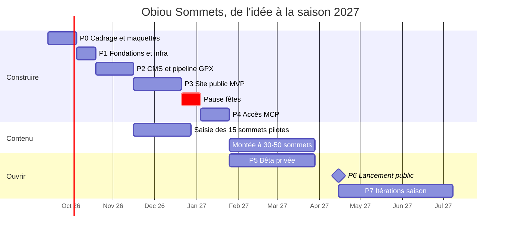

# Roadmap de déploiement — Obiou Sommets

> Statut : **proposition** (13 septembre 2026).
> Hypothèse de rythme : **une personne + Claude Code, environ 2 jours par semaine**. À plein temps,
> divise les durées par 2 à 2,5. Le contenu (reconnaissance terrain, saisie, photos) est compté à part :
> c'est le vrai goulot.

## Vue calendrier

**Pourquoi un lancement mi-avril 2027** : un site de randonnée qui ouvre en décembre ouvre face à des
sommets enneigés, que personne ne cherche. L'hiver sert à construire, saisir le contenu et tester.
On ouvre juste avant que les recherches « randonnée + sommet » remontent.

---

## Phase 0 — Cadrage et maquettes · 14 sept. → 4 oct. 2026

**Objectif** : décider ce qui coûte cher à changer plus tard.

- ✅ Décidés le 13 sept. : sous-domaine `sommets.obiou.eu`, site non commercial, contenu = tes sorties
  dans les Alpes et en Corée du Sud.
- Reste à trancher : cotation, FIT au lancement, dépôt public, fond de carte hors de France
  (D2, D5, D6, D9 de l'[architecture](01-architecture-technique.md#14-décisions-ouvertes)).
- Juridique : demander la clé SCAN 25 et relire ses CGU, rédiger l'avertissement (« récit de sortie,
  pas un topo officiel »).
- **Inventaire de tes traces** : exporter l'historique de ta montre ou de ton appli (Garmin Connect,
  Strava…), repérer les sorties avec sommet, choisir **15 sommets pilotes** mêlant Alpes et Corée.
- ✅ Maquettes générées pour tous les écrans (45 artboards, lien dans le README). Reste à itérer
  dessus et à valider le parcours mobile.
- Écrire un PRD léger (1 à 2 pages) et la liste des epics. Voir l'avis critique sur la taille du
  processus.

**Critère de sortie** : maquettes validées pour la carte, la fiche sommet, la fiche itinéraire, le
téléchargement et l'import GPX admin. Décisions D1 à D8 écrites. Liste des 15 sommets prête.

## Phase 1 — Fondations · 5 → 18 oct. 2026

> **Avancement au 13 sept. 2026** : monorepo, CI verte, dépôt public, projet Railway (production et
> staging) en EU West, site Nuxt en ligne avec contrôle de la base, image Directus et sauvegarde
> testées. **Reste côté propriétaire** : poser les secrets Directus (`SECRET`, compte admin, clé
> licence), puis vérifier la première connexion à l'admin. Détails dans `CLAUDE.md`.
> **14 sept.** : Directus en ligne en production, 2FA et licence actives. Pas d'e-mail (SMTP bloqué).

**Objectif** : un `git push` déploie tout seul en staging, et une sauvegarde est restaurable.

- Monorepo pnpm (`apps/web`, `apps/cms`, `packages/geo`, `packages/domain`, `db/views`), lint,
  typecheck, Vitest, `CLAUDE.md`.
- Dépôt GitHub (public recommandé), CI unique et frugale.
- Railway (voir la [procédure](#procédure-de-déploiement-railway--obioueu) ci-dessous) :
  - projet `obiou-sommets`, environnements `staging` et `production` ;
  - Postgres **avec PostGIS**, volume persistant, **région EU vérifiée** ;
  - bucket S3, région EU ;
  - service `cms` (Directus 12) et service `web` (Nuxt « hello carte ») branchés sur GitHub.
- DNS Hostinger pour staging (ou domaines `*.up.railway.app` au début).
- ~~Resend branché sur Directus~~ : abandonné, Railway Hobby bloque le SMTP sortant (14 sept. 2026).
- Service `backup` (reprendre le modèle d'obioucounting), plus un **test de restauration réel**.

**Critère de sortie** : merge sur `staging` → build Railway → site et admin accessibles. Restauration
d'un dump réussie sur une base vierge.

## Phase 2 — CMS et pipeline GPX · 19 oct. → 15 nov. 2026

**Objectif** : un éditeur crée un sommet et ses itinéraires **sans toucher au code**.

- Collections Directus, relations, champs géo, rôles (Admin, Éditeur, Contributeur, Agent IA),
  workflow de statuts, aperçu. **Snapshot du schéma versionné.**
- `packages/geo`, piloté par les tests, sur un corpus d'une vingtaine de **tes** GPX réels (Alpes et
  Corée ; propres, bruités, avec pauses, aller-retour, multi-segments) :
  - parsing sûr, nettoyage des métadonnées personnelles, zone de confidentialité ;
  - altitude : baromètre si présent, sinon IGN (France, par lots, 5 req/s) ou Copernicus DEM
    (ailleurs) ;
  - distance, D+/D- avec hystérésis, altitudes extrêmes, durée DIN 33466 ;
  - simplification et profil ;
  - exports GPX, KML et GeoJSON, puis FIT en tâche isolée.
- Extension **hook** : dépôt GPX → calculs → exports → bucket → anomalies.
- Extensions **interface** : aperçu carte et profil dans le formulaire, sélecteur de position IGN.
- Vues SQL publiques et rôle Postgres en lecture seule, avec un test de contrat contre le snapshot.
- **Test utilisateur réel** : saisis toi-même 3 sommets et 6 itinéraires en chronométrant.

**Critère de sortie** : un sommet et 2 itinéraires créés en **moins de 20 minutes**, stats cohérentes
à ±5 % avec une référence (Géoportail, carte papier), exports ouverts sans erreur dans Garmin
Connect et OsmAnd.

## Phase 3 — Site public MVP · 16 nov. → 20 déc. 2026

**Objectif** : trouver un sommet et télécharger sa trace en moins d'une minute, sur mobile.

- Carte : fonds IGN, clusters, recherche, filtres, géolocalisation, URL partageable.
- Fiche sommet : panneau latéral ou bottom sheet, plus page complète SSR.
- Fiche itinéraire : trace, **profil synchronisé**, infos pratiques, étapes, conseils, dangers,
  date de vérification.
- **Téléchargement** : choix du format, compteur serveur, URL signée, QR code (desktop → téléphone),
  guide d'import par appareil.
- Liste et recherche, page massif, favoris locaux.
- Pages éditoriales et légales depuis Directus, formulaire de signalement.
- SEO : sitemap, JSON-LD, Open Graph, URLs françaises. Cache SWR et purge à la publication.
- Accessibilité AA, mode sombre, états vides, chargement et erreur.

**Critère de sortie** : Lighthouse mobile ≥ 90 en performance, accessibilité et SEO sur les 3 pages
clés. Parcours « carte → sommet → itinéraire → GPX » réussi par 3 personnes non averties.

*Pause des fêtes : 21 déc. 2026 → 3 janv. 2027.*

## Phase 4 — Accès MCP · 4 → 24 janv. 2027

**Objectif** : un assistant IA répond juste, et ne peut pas nuire.

- **MCP public** (`/mcp`, mcp-toolkit) : les 7 outils, le prompt `preparer_ma_sortie`, limite de
  débit, annotations lecture seule.
- **MCP admin** (Directus) : activation, rôle Agent IA en brouillons uniquement, protection des
  suppressions, OAuth et jeton statique, journal visible dans le tableau de bord.
- Tests avec MCP Inspector, Claude Code, Claude Desktop et un connecteur personnalisé claude.ai.
- **Jeu d'évaluation** de 20 questions réelles (« une rando de moins de 1 000 m de D+ accessible en
  bus depuis Grenoble », « quel itinéraire pour l'Obiou si je n'aime pas le vide ? ») avec les
  réponses attendues.
- **Tests négatifs** : l'agent tente de publier, supprimer, modifier un utilisateur ou lire le
  schéma → refus à chaque fois.
- Page `/assistant-ia` avec instructions de connexion par client.

**Critère de sortie** : 18/20 scénarios corrects, 100 % des tests négatifs refusés.

## Phase 5 — Contenu et bêta privée · 25 janv. → 31 mars 2027

**Objectif** : assez de contenu pour être utile, et zéro surprise au lancement.

- **Contenu** : tes sorties, de 30 à 50 sommets. Comme les traces et les photos existent déjà, le
  travail est surtout rédactionnel : compter environ 1 h par itinéraire (accès, vigilance, récit).
- **Carte hors de France** : vérifier le rendu du fond outdoor et du relief en Corée et en Suisse,
  ainsi que le repli si le quota gratuit est atteint.
- **Bêta** : 20 à 30 testeurs (club alpin local, amis randonneurs, un ou deux accompagnateurs).
- **Matrice d'import réelle** : Garmin (Connect et montre), Suunto, Coros, Apple Watch (via app
  tierce), Komoot, OsmAnd, IGNrando', Iphigénie. Chaque format sur chaque appareil disponible.
- Revue de sécurité (`/security-review`), test de charge léger sur `/telecharger` et `/mcp`, exercice
  de restauration complet.
- Relecture juridique de l'avertissement et des mentions légales.

**Critère de sortie** : aucun bug bloquant, formats validés sur au moins 4 appareils, 100 % des
fiches vérifiées dans les 12 derniers mois.

## Phase 6 — Lancement public · mi-avril 2027

- Bascule DNS de production (`sommets.obiou.eu`, `admin.sommets.obiou.eu`).
- Supervision active : sonde de disponibilité, alertes d'erreurs, facture Railway.
- Google Search Console : soumission du sitemap.
- Communication : clubs et sections CAF, offices de tourisme du Dévoluy et du Trièves, forums,
  annuaires MCP.
- Bandeau « enneigement possible au-dessus de 2 000 m jusqu'en juin » géré depuis l'admin.

**Critère de sortie** : 7 jours sans incident, sauvegardes vertes, premiers signalements traités.

## Phase 7 — Pendant la saison · mai → juillet 2027

Backlog à prioriser **selon les données** (téléchargements, recherches sans résultat, signalements) :

1. Export FIT, si reporté.
2. Conditions récentes : signalements publics datés et modérés.
3. Bulletins d'estimation du risque d'avalanche (BERA) et bascule « mode hiver » à l'automne.
4. Comptes utilisateurs, seulement si les favoris locaux ne suffisent pas.
5. Anglais (Directus gère les traductions).
6. PWA hors ligne pour les fiches favorites.
7. Extension à un deuxième massif.
8. Envoi direct vers Garmin ou Suunto, qui demande un partenariat avec la marque.

---

## Procédure de déploiement Railway + obiou.eu

### 1. Projet et environnements

1. Créer le projet Railway `obiou-sommets` (**séparé** d'obioucounting).
2. Créer les environnements `staging` et `production`.
3. Pour **chaque** service, choisir la région EU (Amsterdam) **puis la vérifier** dans la
   configuration réelle du service.

### 2. Services

| Service | Source | Build | Variables clés |
|---|---|---|---|
| `postgres` | Template PostGIS | image | `POSTGRES_*`, volume `/var/lib/postgresql/data` |
| `cms` | GitHub `apps/cms` | Dockerfile (Directus 12 + extensions) | `KEY`, `SECRET`, `DB_CLIENT=pg`, `DB_CONNECTION_STRING` (référence Railway), `PUBLIC_URL`, `STORAGE_LOCATIONS=s3`, `STORAGE_S3_*`, `EMAIL_TRANSPORT=smtp` + `EMAIL_SMTP_*` (Resend), `RATE_LIMITER_ENABLED=true`, variables MCP/OAuth selon la doc Directus, clé d'enregistrement Directus |
| `web` | GitHub `apps/web` | Dockerfile `node:22-alpine` | `DATABASE_URL_READONLY`, `S3_*` (lecture et signature), `NUXT_PUBLIC_SITE_URL`, `REVALIDATE_SECRET`, `IGN_SCAN25_KEY` (facultatif) |
| `backup` | GitHub `backup/` | Dockerfile, cron `0 2 * * *`, redémarrage `NEVER` | références vers `postgres` et le bucket |
| bucket | Railway Bucket | — | région EU |

Utiliser des **références de variables Railway** (`${{postgres.DATABASE_URL}}`) plutôt que des
secrets recopiés à la main.

### 3. Branches et déclencheurs

- `staging` → environnement staging, `main` → production. Intégration GitHub Railway **uniquement**
  (pas de `railway up` en workflow, pour éviter les doubles builds).
- Commande de pré-déploiement `cms` : `npx directus bootstrap && npx directus schema apply --yes ./snapshots/schema.yaml`.
- Commande de pré-déploiement `web` : application des vues SQL (`db/views`), idempotente.

### 4. DNS chez Hostinger

1. Dans Railway, ajouter le domaine personnalisé `sommets.obiou.eu` au service `web` de production.
   Railway fournit une cible CNAME **unique**.
2. Chez Hostinger, créer `sommets` en CNAME vers cette cible exacte.
3. Même chose pour `admin.sommets.obiou.eu` sur le service `cms`.
4. Attendre le certificat TLS (quelques minutes), puis vérifier :
   `curl -sI https://sommets.obiou.eu/ | head -1`.

### 5. Vérifier une mise en production

- `GET /api/health` → 200 **et** base réellement interrogée.
- Une page de fiche publiée récemment → 200 et contenu à jour (purge de cache effective).
- `POST /mcp` avec `tools/list` → les 7 outils.
- Téléchargement d'un GPX → 302 vers l'URL signée, puis fichier valide.
- Log de déploiement `cms` : `schema apply` sans erreur.

### 6. Retour arrière

- **Code** : redéployer le déploiement précédent dans Railway. ⚠️ Cela restaure l'**image**, pas le
  schéma.
- **Schéma** : les changements Directus sont en avant seulement. On corrige par un nouveau snapshot,
  jamais par une restauration à chaud.
- **Données** : restauration du dernier dump sur une base neuve, bascule de la variable, puis
  vérification.

### 7. Checklist de lancement

- [ ] Région EU vérifiée sur tous les services et le bucket
- [ ] 2FA activée pour tous les administrateurs Directus
- [ ] Rôle Agent IA : tests négatifs passés en production
- [ ] Sauvegarde de la nuit présente **et** restaurée avec succès
- [ ] `robots.txt` : staging en `noindex`, production indexable, canonical correct
- [ ] Mentions légales, confidentialité, avertissement visibles
- [ ] Attribution IGN visible sur toutes les cartes
- [ ] Sonde de disponibilité et alertes actives
- [ ] Sitemap soumis
