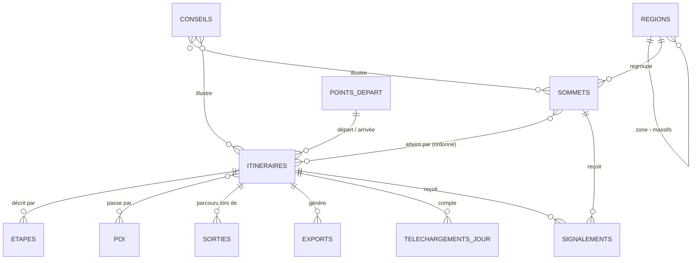

# Modèle de données — Obiou Sommets

> Statut : **validé le 18 septembre 2026**, sauf la section « Langues », ajoutée le même jour et
> à valider (4 questions en fin de document). Détaille le § 5 de
> l'[architecture](01-architecture-technique.md#5-modèle-de-données) avec les décisions du 18 sept.
> (D2, D5, D7, D9) et ce que montrent les maquettes. Une fois validé, **ce document fait foi** pour
> le détail des champs ; le snapshot Directus (`apps/cms/snapshots/`) en sera la traduction exacte.

## En bref

- **13 collections**, 4 tables de liaison et 10 tables de traductions (plus celles que Directus
  crée pour les listes de photos), le singleton `parametres_site` et deux champs ajoutés aux
  fichiers Directus (`credit`, `alt`).
- **Deux langues** : français (source) et anglais. Les textes traduisibles vivent dans des tables
  `…_traductions`, une ligne par langue. Ajouter le coréen plus tard, c'est ajouter une ligne, sans
  toucher au schéma.
- **Tout ce qui se calcule n'est jamais saisi** : distance, dénivelés, durée, effort viennent du
  GPX ; les kilomètres des étapes et des POI se déduisent de leur position sur la trace. On ne
  stocke pas deux fois la même information.
- **Deux sortes de champs** : ceux que tu saisis, et ceux que le pipeline GPX remplit, en lecture
  seule dans l'admin. Quand tu dois pouvoir corriger un calcul (la durée), il y a deux champs : le
  calcul et ta correction, et c'est ta correction qui s'affiche.
- **Le public ne voit que des vues SQL** (`public_*`), filtrées sur le contenu publié. Les GPX
  bruts, les anomalies et les signalements n'y apparaissent jamais.
- **4 questions sur les langues** en fin de document, chacune avec ma recommandation. Les 5
  premières questions sont tranchées.

## Vue d'ensemble

## Conventions

| Sujet | Règle |
|---|---|
| Identifiants | Entiers auto-incrémentés (défaut Directus). Les URL publiques utilisent les **slugs**, jamais les identifiants. |
| Slugs | Minuscules, sans accent, générés depuis le nom, **uniques par collection** (et par langue pour les itinéraires et les pages). **Figés une fois publiés** (décidé le 18 sept.). |
| Statut | `brouillon` · `en_relecture` · `publie` · `archive` sur les contenus publiables. Valeurs techniques sans accent, libellés accentués dans l'admin. `date_publication` posée à la première publication. |
| Géométries | PostGIS, **WGS 84 (SRID 4326), en 2D**. Les altitudes vivent dans `altitude_m` et dans le `profil` ; le GPX exporté garde la trace 3D complète. Directus ne gère pas clairement la dimension Z, on ne dépend donc pas d'elle. |
| Unités | Mètres et minutes en **entiers** (`distance_m`, `duree_…_min`). La conversion en km et en heures se fait à l'affichage. |
| Textes longs | Markdown. |
| Listes courtes | JSON (listes de mois, d'équipements, de points de vigilance). |
| Traçabilité | Champs système Directus sur chaque collection de contenu : `date_created`, `date_updated`, `user_created`, `user_updated`. Ils alimentent le tableau de bord (« brouillons créés par l'IA ») et remplacent le `verifie_par` de l'architecture. |
| Langues | Français (source) et anglais : voir la section « Langues ». Les sommets coréens ont aussi un nom local (hangeul) et une romanisation. |

## Langues

> Ajoutée le 18 septembre 2026 à ta demande, **à valider** (questions L1 à L4).

Le site existe en **français**, langue source, et en **anglais**. Le mécanisme est l'interface
« Traductions » de Directus :
- chaque collection concernée a une table `<collection>_traductions`, avec une ligne par langue, qui
  porte les champs traduits 🌐 ;
- le reste (position, altitude, calculs, relations) est commun à toutes les langues ;
- dans l'admin, les traductions apparaissent en onglets FR | EN dans le même formulaire.

**Collection `langues`** : `code` (`fr`, `en`), `nom`, `ordre`, `source` (vrai pour `fr`).

**Chaque traduction a son statut**, `brouillon` ou `publie`. Un contenu apparaît dans une langue
quand il est publié **et** que sa traduction dans cette langue l'est (question L2). La version
française, source, suit le statut du contenu.

| Collection | Champs traduits 🌐 |
|---|---|
| `regions` | `nom` (Alpes → Alps), `description` |
| `sommets` | `description`, `reglementation` |
| `itineraires` | `nom`, `slug`, `description`, `points_vigilance`, `equipement`, `reglementation` |
| `etapes` | `titre`, `texte` |
| `points_depart` | `nom`, `acces_routier`, `parking`, `transport_commun` |
| `poi` | `description` |
| `sorties` | `conditions`, `recit` |
| `conseils` | `titre`, `texte` |
| `pages` | `titre`, `slug`, `contenu` |
| `parametres_site` | `bandeau_texte` |
| fichiers | `alt`, le texte alternatif des photos, une valeur par langue |

**Ce qui n'est pas traduit** :
- les noms propres : sommets, massifs, POI (« Obiou », « Dévoluy », « Cabane du vallon ») — question L3 ;
- les slugs des sommets et des massifs ;
- les données chiffrées ;
- les libellés des listes (cotation T1–T6, types, catégories) : ils se traduisent dans le code du
  site, pas en base.

**Adresses** : le français est à la racine, l'anglais sous `/en` (question L4) :
`/sommets/obiou/voie-normale-par-le-vallon` ↔ `/en/summits/obiou/normal-route-via-the-valley`.
Chaque page déclare ses autres versions (`hreflang`), et le sitemap liste les deux langues.

**Recherche et MCP** : la recherche plein texte utilise le dictionnaire de la langue (français ou
anglais). Les outils du MCP public prennent un paramètre `langue`, `fr` par défaut.

**Traduction assistée** : l'agent IA (MCP) peut rédiger la traduction anglaise **en brouillon** ; tu
la relis et tu la publies. C'est la règle « brouillons seulement », telle quelle.

**Traduction à revoir** : quand le texte français change après la traduction, l'admin signale la
traduction anglaise « à revoir » (source modifiée après elle). À outiller en phase 2, avec les
autres extensions.

## Collections

Légende : **Obl.** = obligatoire pour publier. 🔒 = jamais public. ⚙️ = calculé par le pipeline,
lecture seule dans l'admin. 🌐 = traduit : le champ vit dans la table `…_traductions`, avec une
valeur par langue.

### `regions` — zones et massifs

Deux niveaux, comme dans les maquettes (« Alpes › Dévoluy », « Corée du Sud › Jeju ») : une
**zone** (Alpes, Corée du Sud), qui alimente le sélecteur de région de la carte, puis ses
**massifs**. Le pays n'est pas porté ici : les Alpes en couvrent plusieurs.

| Champ | Type | Obl. | Notes |
|---|---|---|---|
| 🌐 `nom` | texte | ✓ | zones traduites (« Alpes » → « Alps ») ; les massifs gardent leur nom propre (« Dévoluy ») dans les deux langues |
| `slug` | texte, unique | ✓ | `/massifs/devoluy` |
| `niveau` | choix : `zone` · `massif` | ✓ | |
| `parent` | → `regions` | massif ✓ | la zone d'un massif |
| 🌐 `description` | markdown | | page massif |
| `ordre` | entier | | ordre d'affichage |
| `emprise` | Polygon | | facultatif, pour recentrer la carte |

### `sommets`

| Champ | Type | Obl. | Notes |
|---|---|---|---|
| `statut`, `date_publication` | voir conventions | ✓ | |
| `nom` | texte | ✓ | « Obiou », « Hallasan » ; nom propre, non traduit |
| `nom_local` | texte | | « 한라산 » |
| `romanisation` | texte | | « Hallasan » (romanisation révisée) |
| `slug` | texte, unique | ✓ | généré depuis le nom |
| `position` | Point | ✓ | sélecteur sur carte |
| `altitude_m` | entier | ✓ | saisie ; l'admin suggère l'altitude du modèle de terrain au point |
| `pays` | choix : `FR` · `CH` · `IT` · `KR` | ✓ | codes ISO |
| `region` | → `regions` (massif) | ✓ | |
| `fond_carte` | choix : `auto` · `ign` · `outdoor` | ✓ | `auto` par défaut : IGN en France, fond outdoor ailleurs (D9). Le fournisseur n'est pas stocké : il peut changer (MapTiler, PMTiles). |
| 🌐 `description` | markdown | ✓ | |
| `photo_couverture` | fichier | | crédit obligatoire |
| `galerie` | fichiers (liste) | | crédit obligatoire |
| `mois_conseilles` | JSON, mois 1–12 | | |
| `reservation_requise` | booléen | | étiquette sur la carte et la fiche (Hallasan) |
| 🌐 `reglementation` | markdown | | règles communes à tous les itinéraires |
| `tags` | liste | | |
| `sources` | markdown | | crédits et sources des informations |

### `itineraires`

| Champ | Type | Obl. | Notes |
|---|---|---|---|
| `statut`, `date_publication` | voir conventions | ✓ | |
| 🌐 `nom` | texte | ✓ | « Voie normale par le vallon » |
| 🌐 `slug` | texte, unique par langue | ✓ | `/sommets/obiou/voie-normale-par-le-vallon`, `/en/summits/obiou/normal-route-via-the-valley` |
| `sommets` | ↔ `sommets`, **ordonné** | ✓ | via `itineraires_sommets` ; plusieurs pour une traversée |
| `type` | choix : `aller_retour` · `boucle` · `traversee` | ✓ | |
| `cotation` | choix : `T1` … `T6` | ✓ | **échelle SAC (D2)**, voir plus bas |
| `point_depart` | → `points_depart` | ✓ | |
| `point_arrivee` | → `points_depart` | traversée ✓ | vide pour un aller-retour ou une boucle |
| 🌐 `description` | markdown | ✓ | chapeau de la fiche |
| 🌐 `points_vigilance` | JSON, liste de textes | | « Pas rocheux exposé au km 6 » |
| 🌐 `equipement` | JSON, liste de textes | | « Chaussures à tige haute », « 2 L d'eau »… |
| `mois_praticables` | JSON, mois 1–12 | | |
| `reservation_requise` | booléen | | propre à cet itinéraire |
| 🌐 `reglementation` | markdown | | ex. fermeture saisonnière d'un sentier coréen |
| `duree_estimee_min` | entier | | **ta correction** de la durée ; vide = le calcul s'affiche |
| `verifie_le` | date | | vérification sans sortie complète (un passage partiel, un échange avec la mairie…) |
| 🔒 `gpx_source` | fichier (dossier privé) | ✓ | le GPX déposé, jamais servi tel quel |
| 🔒 `masquer_extremites` | booléen | | retire 200 m au début et à la fin (hébergement) |
| 🔒 `source_altitude_forcee` | choix : vide · `barometre` · `ign` · `copernicus` · `gps` | | vide = choix automatique |
| ⚙️ `trace` | LineString | | trace nettoyée, pleine résolution |
| ⚙️ `trace_simplifiee` | LineString | | pour la carte (Douglas-Peucker) |
| ⚙️ `profil` | JSON | | points `{ d, z }` échantillonnés, distance et altitude en mètres |
| ⚙️ `distance_m` | entier | | |
| ⚙️ `denivele_pos_m`, `denivele_neg_m` | entier | | seuil d'hystérésis d'environ 5 m |
| ⚙️ `altitude_min_m`, `altitude_max_m` | entier | | |
| ⚙️ `duree_calculee_min` | entier | | DIN 33466 |
| ⚙️ `effort_km` | décimal | | kilomètre-effort, voir question 2 |
| ⚙️ `source_altitude_utilisee` | choix | | celle que le pipeline a retenue |
| ⚙️ 🔒 `anomalies` | JSON | | sauts GPS, emprise incohérente… ; en présence d'anomalie, le statut repasse en relecture |
| ⚙️ 🔒 `calcule_le` | date et heure | | |

**Cotation SAC (D2)**, libellés de l'admin et de la fiche :

| Valeur | Libellé |
|---|---|
| `T1` | Randonnée |
| `T2` | Randonnée en montagne |
| `T3` | Randonnée en montagne exigeante |
| `T4` | Randonnée alpine |
| `T5` | Randonnée alpine exigeante |
| `T6` | Randonnée alpine difficile |

**Tables de liaison** : `itineraires_sommets` (`itineraire`, `sommet`, `ordre`),
`itineraires_poi` (`itineraire`, `poi`), `itineraires_conseils` et `sommets_conseils`
(`conseil`, cible). Le kilomètre d'un POI sur l'itinéraire n'est **pas stocké** : la vue le calcule
en projetant le POI sur la trace (`ST_LineLocatePoint`). Il suit donc la trace quand tu la remplaces.

### `etapes`

| Champ | Type | Obl. | Notes |
|---|---|---|---|
| `itineraire` | → `itineraires` | ✓ | |
| `ordre` | entier | ✓ | glisser-déposer dans l'admin |
| 🌐 `titre` | texte | ✓ | « Cabane → source du vallon » |
| 🌐 `texte` | markdown | | |
| `position_fin` | Point | | fin de l'étape ; donne les km et altitudes affichés (« km 2,8 – 3,4 · 1 640 → 1 790 m »), calculés par la vue |
| `photo` | fichier | | crédit obligatoire |

### `points_depart`

| Champ | Type | Obl. | Notes |
|---|---|---|---|
| 🌐 `nom` | texte | ✓ | « Parking du vallon » |
| `position` | Point | ✓ | |
| `altitude_m` | entier | | suggérée depuis le modèle de terrain |
| `commune` | texte | | commune du point de départ |
| 🌐 `acces_routier` | markdown | | |
| 🌐 `parking` | markdown | | capacité, payant ou non |
| 🌐 `transport_commun` | markdown | | « Bus jusqu'au village, puis 3 km à pied » ; s'il est rempli, l'itinéraire compte comme accessible en transport en commun (filtre de recherche et MCP) |

Pas de statut : un point de départ devient public quand un itinéraire publié l'utilise.

### `poi` — points d'intérêt

| Champ | Type | Obl. | Notes |
|---|---|---|---|
| `type` | choix : `refuge` · `cabane` · `source` · `point_de_vue` · `passage_cle` · `danger` · `autre` | ✓ | les sources remplacent le champ `points_eau` de l'architecture |
| `nom` | texte | ✓ | « Cabane du vallon » |
| `position` | Point | ✓ | |
| `altitude_m` | entier | | |
| 🌐 `description` | texte court | | « Non gardée, 6 places », « À traiter » |
| `lien` | URL | | |

Pas de statut non plus : un POI devient public par un itinéraire publié.

### `sorties` — le carnet

| Champ | Type | Obl. | Notes |
|---|---|---|---|
| `itineraire` | → `itineraires` | ✓ | |
| `date` | date | ✓ | pré-remplie depuis le GPX brut |
| `heure_depart` | heure | | pré-remplie depuis le GPX brut |
| `duree_marche_min` | entier | | pré-remplie depuis le GPX brut |
| 🌐 `conditions` | texte court | | « Ciel dégagé », « Neige au-dessus de 2 400 m » |
| 🌐 `recit` | markdown | | court |
| `photos` | fichiers (liste) | | crédit obligatoire |
| `publique` | booléen, oui par défaut | | voir question 1 |
| 🔒 `gpx_brut` | fichier (dossier privé) | | la trace de ce jour-là, avec ses horodatages ; jamais publiée |

La sortie la plus récente donne la **date de dernière vérification** de l'itinéraire (le plus récent
de `sorties.date` et `itineraires.verifie_le`, calculé par la vue). Les pastilles « récente · à
revoir · ancienne » de la liste admin en découlent.

Les horodatages du GPX brut servent **en privé** à pré-remplir la sortie. Ils sont retirés de tout
ce qui est publié (invariant « aucune métadonnée personnelle dans un GPX publié »).

### `conseils`

| Champ | Type | Obl. | Notes |
|---|---|---|---|
| `statut` | voir conventions | ✓ | |
| 🌐 `titre` | texte | ✓ | « Partir avant 7 h » |
| 🌐 `texte` | markdown | ✓ | |
| `categorie` | choix : `securite` · `logistique` · `saison` · `faune_flore` · `photo` | ✓ | |
| `global` | booléen | | affiché partout (guides) |
| `sommets`, `itineraires` | ↔ | | rattachements, via les tables de liaison |

### `exports` — ⚙️ entièrement générée

| Champ | Type | Notes |
|---|---|---|
| `itineraire` | → `itineraires` | |
| `format` | choix : `gpx` · `kml` · `geojson` · `fit` | `fit` selon D5 : au lancement s'il passe les tests sur 3 montres réelles |
| `fichier` | fichier (dossier des exports) | servi par une URL signée courte |
| `taille_octets` | entier | « GPX · 84 Ko » |
| `sha256` | texte | |
| `genere_le` | date et heure | |

Un seul export par itinéraire et par format : chaque dépôt de GPX les remplace.

### `signalements` — 🔒 jamais public

| Champ | Type | Notes |
|---|---|---|
| `sommet` / `itineraire` | → | l'un ou l'autre, ou aucun (signalement général) |
| `page` | texte | l'URL depuis laquelle on signale |
| `type` | choix : `trace_erronee` · `danger` · `info_obsolete` · `autre` | |
| `message` | texte | |
| `email` | texte | facultatif |
| `statut` | choix : `nouveau` · `en_cours` · `traite` · `rejete` | |
| `cree_le` | date et heure | purge automatique au bout de 12 mois (Flow planifié) |

### `telechargements_jour` — 🔒 compteurs agrégés

`itineraire` · `format` · `jour` · `compteur`, unique sur (`itineraire`, `format`, `jour`). **Sans
IP ni identifiant.**

### `pages`

`statut` · 🌐 `slug` · 🌐 `titre` · `type` (`a_propos` · `guide` · `legal`) · 🌐 `contenu` (markdown) ·
`ordre`.
Les guides (`/guides/importer-une-trace`, `/guides/cotations`…) sont des pages de type `guide`.

### `parametres_site` — singleton

`bandeau_actif` (booléen) · 🌐 `bandeau_texte` · `bandeau_niveau` (`info` · `alerte`) ·
`zone_par_defaut` (→ `regions`, zone ouverte à l'arrivée sur la carte).

### Fichiers : champs `credit` et `alt` sur `directus_files`

Chaque photo porte un **crédit** (« © l'auteur ») ; la maquette bloque l'enregistrement tant qu'une
photo n'en a pas. Elle porte aussi un **texte alternatif par langue** (`alt`, au format
`{ "fr": …, "en": … }`), indispensable à l'accessibilité. Directus ne sait pas traduire les
fichiers, d'où ce champ unique. Trois dossiers : `gpx-prives` 🔒 (GPX sources et bruts), `exports`, `photos`.

## Qui écrit quoi

### Dans Directus

| Rôle | Contenu | Publier | Supprimer | Schéma, utilisateurs, paramètres |
|---|---|---|---|---|
| Administrateur | tout | ✓ | ✓ | ✓ (2FA obligatoire) |
| Éditeur | tout le contenu | ✓ | ✓ | — |
| Contributeur (créé dès maintenant) | brouillons | — | — | — |
| **Agent IA** (MCP) | lit tout sauf les GPX bruts ; crée et modifie **seulement si le statut est `brouillon` ou `en_relecture`** ; rédige les traductions en brouillon | — | — | — |

Pour l'Agent IA, la règle s'étend aux collections sans statut. Il peut modifier les étapes et les
liaisons d'un itinéraire en brouillon, **pas** celles d'un itinéraire publié : sinon, une
modification d'étape serait publiée sans relecture. Il peut créer un POI ou un point de départ (sans
effet public tant qu'un humain ne publie pas l'itinéraire qui les utilise), mais pas modifier un
existant. Signalements en lecture seule.

### Côté site public

Le site ne passe pas par Directus. Il a **deux rôles Postgres**, les plus étroits possibles :

- `site_lecture` : lecture des vues `public_*`, rien d'autre ;
- `site_ecriture` : exécution de **deux fonctions**, et aucun droit direct sur les tables.
  `compter_telechargement(itineraire, format)` incrémente le compteur du jour ;
  `creer_signalement(…)` insère un signalement en vérifiant la taille des champs.

## Ce qui est public : les vues SQL

Filtrées sur `statut = 'publie'`. Un itinéraire n'apparaît que si au moins un de ses sommets est
publié. Chaque vue porte une colonne **`langue`** : une ligne par contenu et par langue publiée. Le
site et le MCP public filtrent sur la langue demandée.

| Vue | Contenu |
|---|---|
| `public_regions` | zones et massifs, avec leur nombre de sommets publiés |
| `public_sommets` | fiche sommet, fond de carte résolu (`auto` → `ign` ou `outdoor`), nombre d'itinéraires |
| `public_itineraires` | fiche itinéraire et statistiques ; `duree_min` = ta correction, sinon le calcul ; date de dernière vérification ; accès en transport en commun (oui/non) |
| `public_itineraires_sommets` | ordre des sommets d'une traversée |
| `public_etapes` | étapes avec km et altitudes, déduits de `position_fin` |
| `public_itineraires_poi` | POI avec leur km sur la trace |
| `public_points_depart` | points de départ des itinéraires publiés |
| `public_sorties` | sorties marquées publiques, **sans GPX** |
| `public_conseils` | conseils publiés et leurs rattachements |
| `public_exports` | formats disponibles, taille, empreinte |
| `public_pages`, `public_parametres` | pages publiées, bandeau |

**Jamais dans une vue** : `gpx_source`, `gpx_brut`, `anomalies`, `calcule_le`, les options du
pipeline, les champs `user_*`, les signalements et les compteurs bruts.

Un **test de contrat** (phase 2) vérifie que ces vues compilent contre le snapshot Directus. Il
casse donc dès qu'une modification de schéma les rendrait invalides.

## Vie privée

- **GPX** : le brut garde horodatages, cardio et modèle de montre, dans le dossier privé. Tout ce qui
  est publié (trace, profil, exports) en est dépourvu. Option `masquer_extremites` pour un départ
  depuis un hébergement.
- **Photos** : un original de téléphone contient souvent la **position GPS dans ses EXIF**. Ne
  servir au public que des versions transformées, qui les retirent. À vérifier en phase 3, image
  réelle à l'appui.
- **Sorties** : date, heure de départ et durée de marche d'une sortie sont des informations sur
  toi. Leur publication est un choix (question 1).
- **Signalements** : e-mail facultatif, jamais public, purgé à 12 mois.

## Exemples

Les chiffres viennent des maquettes : ils sont **fictifs**.

**Obiou** : zone Alpes › massif Dévoluy, `pays` FR, 2 789 m, fond IGN (automatique).
Itinéraire « Voie normale par le vallon » : aller-retour, T3, départ « Parking du vallon »
(1 269 m), GPX d'une montre à baromètre. Le pipeline calcule 13,8 km, 1 520 m D+, une durée de
7 h 05, que tu corriges en 7 h 30. POI : cabane du vallon (km 2,8), source (km 3,4). Sortie
publique du 17 août 2025, départ 6 h 10.

**Hallasan** (한라산) : zone Corée du Sud › massif Jeju, `pays` KR, 1 947 m, fond outdoor
(automatique). `reservation_requise` sur le sommet. Deux itinéraires, Seongpanak et Gwaneumsa, avec
leurs règles propres dans `reglementation` (heures limites de passage).

## Décisions du 18 septembre

1. **Sorties publiques** : oui, avec une case `publique` par sortie pour en garder pour toi.
2. **Kilomètre-effort** affiché à côté de la cotation : oui.
3. **Slug verrouillé** une fois publié : oui ; une table de redirections plus tard si besoin.
4. **Rôle Contributeur** : créé dès maintenant.
5. **Deux niveaux zone › massif** : oui ; le pays reste porté par le sommet.

## Questions sur les langues

- **L1. Français comme source, anglais, et coréen plus tard sans changer le schéma ?**
  **Recommandation** : oui.
- **L2. Un contenu n'apparaît en anglais que si sa traduction est publiée ?** Sinon, le sélecteur
  de langue renvoie vers la version française. **Recommandation** : oui. Une page anglaise à moitié
  en français gêne la lecture et le référencement. Le site anglais sera plus petit au début.
- **L3. Noms propres non traduits** (sommets, massifs, POI), mais noms d'itinéraires et de points
  de départ traduits (« Voie normale par le vallon » → « Normal route via the valley ») ?
  **Recommandation** : oui. Ce sont les noms qu'on lit sur le terrain et sur les cartes.
- **L4. Adresses anglaises sous `/en`**, slugs de sommets communs aux deux langues, slugs
  d'itinéraires traduits ? **Recommandation** : oui.

## Ce qui vient ensuite

1. Tu réponds aux 4 questions sur les langues.
2. Création des collections **à la main dans l'admin Directus staging** (choix du 18 sept.), puis
   `directus schema snapshot` vers `apps/cms/snapshots/schema.yaml`.
3. `packages/domain` : types et schémas Zod des vues publiques, partagés par le site et le MCP.
4. `db/views` : les vues `public_*`, les deux rôles Postgres et leurs fonctions, avec le test de
   contrat.
